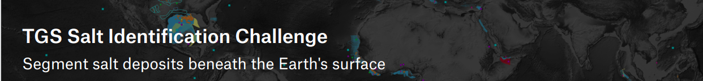

# salt-identification-challenge

  

-----------------------------------------------------

Several areas of Earth with large accumulations of
oil and gas also have huge deposits of salt below 
the surface.

But unfortunately, knowing where large salt deposits
are precisely is very difficult. Professional seismic 
imaging still requires expert human interpretation of
salt bodies. This leads to very subjective, highly 
variable renderings. More alarmingly, it leads to 
potentially dangerous situations for oil and gas company 
drillers.

To create the most accurate seismic images and 3D 
renderings, TGS is hoping Kaggle’s machine learning 
community will be able to build an algorithm that 
automatically and accurately identifies if a subsurface 
target is salt or not.
-------------------------------------------------------

## Challenge website:
 
- [SIC-TGS](https://www.kaggle.com/c/tgs-salt-identification-challenge#description)
